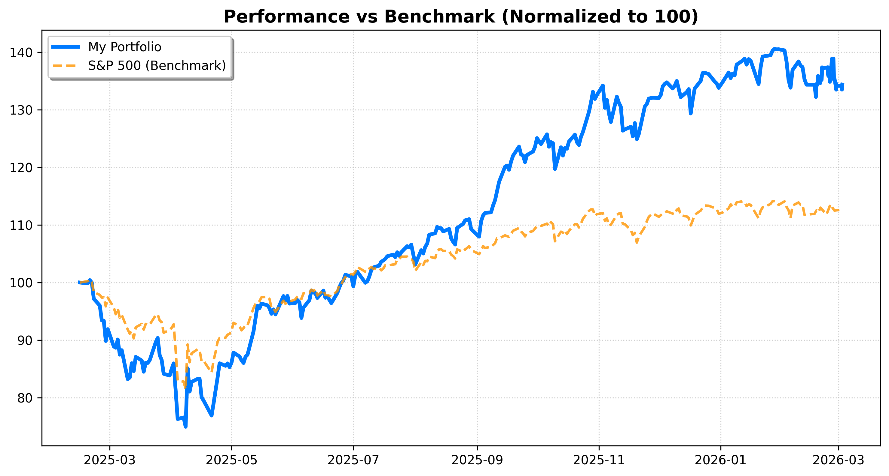
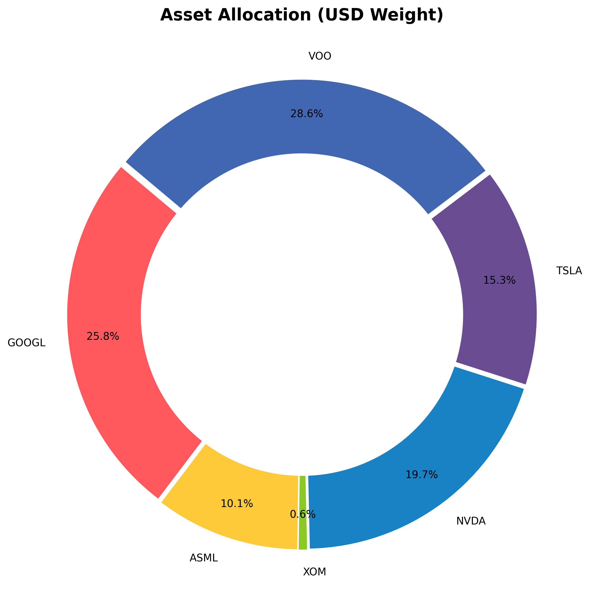

# 📊 Portfolio Dashboard
**עודכן ב:** 17/02/2026 23:41 | **שער דולר:** ₪3.096

## 💰 סיכום ביצועים כולל
- **שווי תיק:** `₪176,411`
- **תשואה מצטברת:** `+35.34%`
- **מקס' ירידה מהשיא (Drawdown):** `-24.97%`
- **מניית הכוכב 🚀:** ASML (+90.6%)
- **המאכזבת 📉:** VOO (+13.4%)

## 📈 גרף ביצועים (מול S&P 500)

## 🥧 התפלגות נכסים

## 📊 פירוט אחזקות
| מניה | כמות | שווי (₪) | משקל בתיק |
| :--- | :--- | :--- | :--- |
| VOO | 24 | ₪46,655 | 26.4% |
| TSLA | 20 | ₪25,422 | 14.4% |
| NVDA | 57 | ₪32,642 | 18.5% |
| XOM | 8 | ₪3,621 | 2.1% |
| GOOGL | 54 | ₪50,488 | 28.6% |
| ASML | 4 | ₪17,583 | 10.0% |

---
📂 *כל הנתונים והארכיון שמורים בתיקיית כתובת האתר לתצוגה:`data_hub`*
https://almog787.github.io/Sapa/