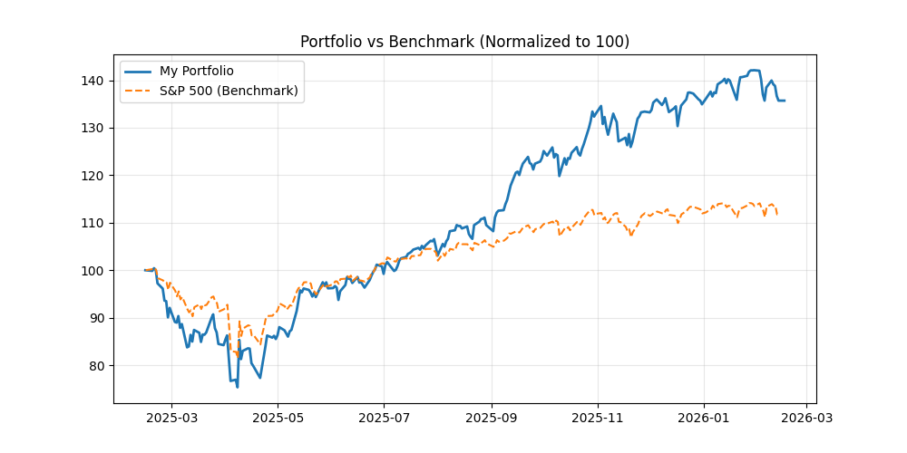

# 📊 Portfolio Dashboard
**עודכן ב:** 16/02/2026 08:42 | **שער דולר:** ₪3.086

## 📈 גרף ביצועים נוכחי

## 🥧 התפלגות נכסים

## 📑 ארכיון דוחות
ניתן למצוא את כל הגרפים ההיסטוריים בתיקיית `archive/charts/`.

## 📊 פירוט אחזקות
| מניה | כמות | שווי (₪) | משקל |
| :--- | :--- | :--- | :--- |
| VOO | 24 | ₪46,425 | 26.3% |
| TSLA | 20 | ₪25,761 | 14.6% |
| NVDA | 57 | ₪32,150 | 18.2% |
| XOM | 8 | ₪3,664 | 2.1% |
| GOOGL | 54 | ₪50,941 | 28.9% |
| ASML | 4 | ₪17,361 | 9.8% |