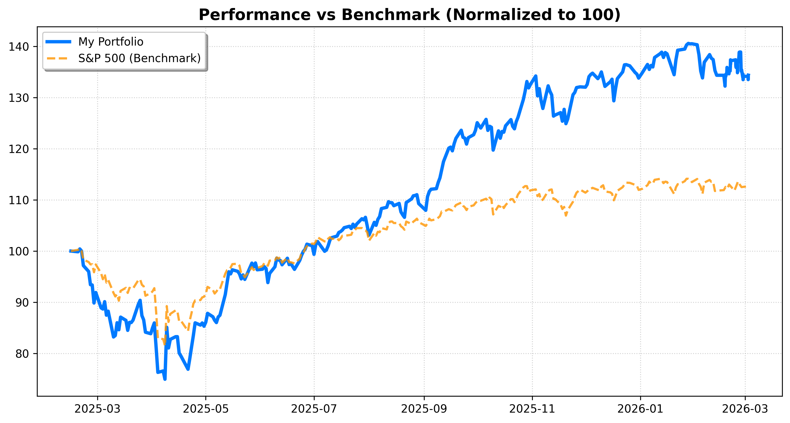
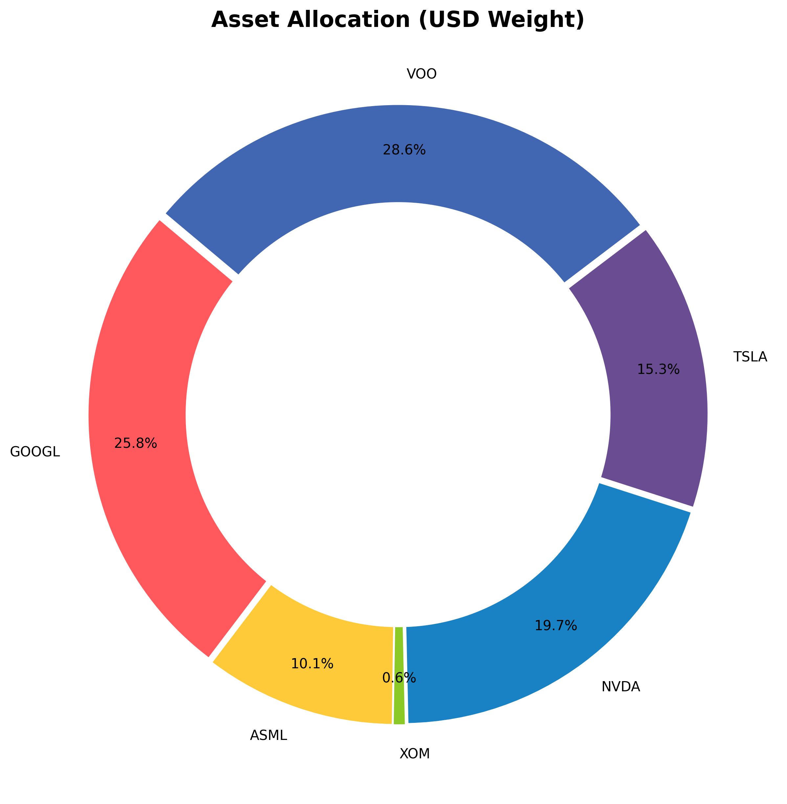

# 📊 Portfolio Dashboard | מעקב תיק השקעות
**Last Update:** 06/03/2026 21:38 | **USD/ILS:** ₪3.088

## 💰 Portfolio Summary | סיכום התיק
| Metric | Value | נתון |
| :--- | :--- | :--- |
| **Current Value** | `₪160,960` | **שווי נוכחי** |
| **Total Invested** | `₪129,690` | **סך השקעה** |
| **Total Profit/Loss** | `+24.11%` (₪31,270) | **רווח/הפסד כולל** |
| **Daily Change** | `-0.58%` | **שינוי יומי** |

## 📜 Holdings | פירוט החזקות
| Ticker | Shares | Avg. Cost | Current Price | P&L % | P&L ILS |
| :--- | :--- | :--- | :--- | :--- | :--- |
| GOOGL | 45 | $181.15 | $298.62 | 🟢 +64.85% | ₪16,323 |
| ASML | 4 | $934.51 | $1,316.63 | 🟢 +40.89% | ₪4,720 |
| XOM | 2 | $126.08 | $151.71 | 🟢 +20.33% | ₪158 |
| NVDA | 57 | $148.62 | $180.04 | 🟢 +21.14% | ₪5,530 |
| TSLA | 20 | $436.45 | $398.58 | 🔴 -8.68% | ₪-2,339 |
| VOO | 24 | $527.38 | $620.18 | 🟢 +17.60% | ₪6,877 |

## 📈 Charts | גרפים

---
📂 *Created by Almog787*